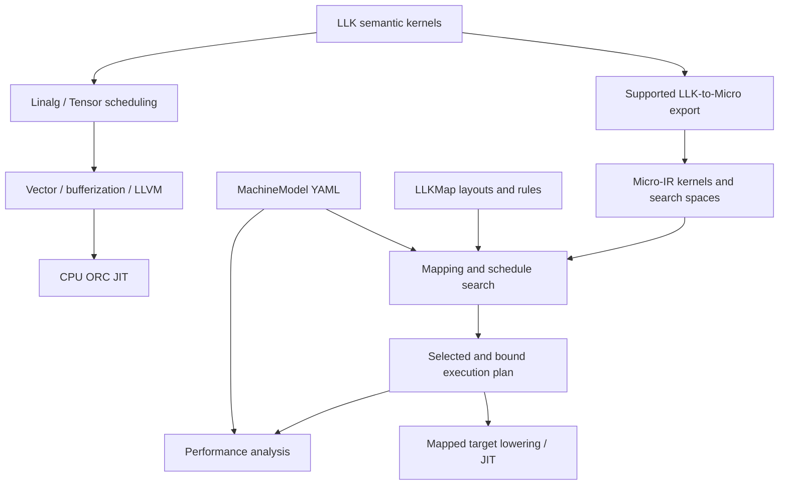

# DSLCompiler

[](https://github.com/skg7on/DSLCompiler/actions/workflows/ci.yml)
[](https://github.com/skg7on/DSLCompiler/actions/workflows/coverage.yml)

DSLCompiler is an out-of-tree [MLIR](https://mlir.llvm.org/) compiler for DNN/LLM kernels and AI chipset performance exploration. Its goal is to describe how a kernel executes, map it onto a machine, estimate resource use and performance, and search for better schedules. Intel AVX2 is the first validation target; the architecture is intended to support additional AI accelerators.

## Core concept

**Semantic IR describes the computation; Micro-IR describes its execution.** The canonical `micro` dialect makes tile dataflow, placement, movement, scheduling, and synchronization explicit. MachineModel YAML describes hardware resources and costs; LLKMap files describe target layouts and mapping rules.

```text
Tile = (shape, dtype, layout, memory_space, owner)
Micro-IR = tile dataflow + tile mapping + tile schedule
Predicted performance = F(Micro-IR, MachineModel, calibration)
```

One dialect has three conceptual layers: **uTile** for tile dataflow, **uMap** for placement and scheduling, and **uHW** for hardware-sized compute and transfer fragments. A concrete `micro.kernel` contains execution primitives; `micro.search_space` represents tunable choices.

## Architecture



The established CPU path uses MLIR tiling, fusion, explicit vectorization, and LLVM execution. The Micro-IR path currently exports LLK matmul and fused SwiGLU; a general Linalg-to-Micro importer is future work.

Mapping follows **extract → match → place → connect → cover → bind → verify**. Generic mapping and machine libraries stay target-neutral; target policy lives in `mapping/`, machine topology in `machines/`, and backend emitters in `lib/Target/`. See the [architecture guide](docs/manual/source/architecture.rst) and [mapping workflow](docs/design/micro-ir-mapping-workflow.md).

## Main features

- **Execution IR:** tile types and verifiers, temporal/spatial loops, pipelines, MMA/vector/reduction operations, layout transforms, explicit movement and synchronization.
- **Declarative mapping:** topology-aware placement and routing, single-operation and fused rules, deterministic/beam/bounded exact covering search, plan binding, reports, and replay.
- **Performance exploration:** static work/bandwidth bounds and dependency/resource scheduling; predicted cycles, traffic, utilization, bottlenecks, and capacity diagnostics.
- **Schedule exploration:** finite parameter spaces, grid/random candidate generation, legality checks, ranking, and schedule persistence.
- **CPU validation:** scheduling, fusion, packing, specialization, parallel runtime, and JIT infrastructure for supported kernels, including SwiGLU, RoPE, and attention. Portable mapped GEMM/SwiGLU numerical fixtures are also available.
- **Target examples:** AVX2 and generic accelerator machine profiles and mapping packages.

The mapped path is under active development: physical feasibility, selected-target code generation, runtime ownership, and original-source tuning still have gaps. Performance predictions are uncalibrated, and the generic accelerator package has no hardware execution backend. The [feature matrix](docs/manual/source/features.rst) records current support and limits.

## Start understanding the project

1. Read the [concepts](docs/manual/source/concepts.rst), then the [architecture](docs/manual/source/architecture.rst) and [feature matrix](docs/manual/source/features.rst).
2. Follow the tutorials: [first kernel](docs/manual/source/tutorials/01-first-kernel.rst), [mapping](docs/manual/source/tutorials/02-mapping.rst), [performance](docs/manual/source/tutorials/03-performance.rst), and [tuning](docs/manual/source/tutorials/04-tuning.rst).
3. Explore `include/LLK/` and `lib/`: `Dialect/` defines the IR, `Conversion/` and `Transforms/` implement compilation, `Machine/` and `Mapping/` implement target exploration, and `Target/` supplies backend implementations. `tools/` provides the command-line entry points; `test/` shows executable examples.

The [developer manual](docs/manual/README.md) is the main documentation entry point. [ARCHITECTURE.md](ARCHITECTURE.md) covers the established CPU pipeline in more depth.

## Build

You need Git, a C++20 compiler, CMake 3.20+, Ninja, Python 3, and a matching LLVM/MLIR development build with headers, CMake packages, TableGen, and FileCheck. CI pins LLVM **22.1.8**. See [setup instructions](docs/manual/source/getting-started.rst) for building LLVM with `LLVM_BUILD_UTILS=ON` and troubleshooting.

Use an isolated worktree, as required by the [repository policy](.claude/rules/worktree-isolation.md):

```bash
git clone https://github.com/skg7on/DSLCompiler.git
cd DSLCompiler
git worktree add .claude/worktrees/explore -b exp/explore
cd .claude/worktrees/explore

export LLVM_BUILD=/absolute/path/to/llvm-project/build
cmake -S . -B build -G Ninja \
  -DLLVM_PROJECT_BUILD_DIR="$LLVM_BUILD" \
  -DCMAKE_BUILD_TYPE=Release \
  -DLLK_BUILD_TOOLS=ON -DLLK_BUILD_E2E_TESTS=ON
cmake --build build --parallel 4
cmake --build build --target check-llk --parallel 4
```

Each worktree needs its own project build directory; the LLVM build can be shared. `check-llk` builds the registered tests and runs CTest.

Libraries are written to `build/lib`; tools and category test executables are written to `build/bin`. Test configuration lives under [`test/`](test/CMakeLists.txt), with GTest sources combined by category and individual cases labeled in CTest. For example, run mapping tests with `ctest --test-dir build -L Mapping --output-on-failure` or `build/bin/LLKMappingTests --gtest_filter='MappingPlan.*'`.

Use `-DBUILD_TESTING=OFF` to omit tests and GoogleTest, or `-DLLK_BUILD_E2E_TESTS=OFF` to exclude JIT execution tests. Configure emits `build/compile_commands.json` for editors unless `-DCMAKE_EXPORT_COMPILE_COMMANDS=OFF` is set.

## Use

Run these commands from the worktree root after building:

```bash
mkdir -p build/examples

# Parse and inspect a semantic kernel.
build/bin/llk-opt docs/manual/source/examples/matmul.mlir

# Export a concrete execution kernel and a tunable search space.
build/bin/llk-compile --emit=micro docs/manual/source/examples/matmul.mlir \
  > build/examples/matmul.micro.mlir
build/bin/llk-compile --emit=micro-search docs/manual/source/examples/swiglu.mlir \
  > build/examples/swiglu.search.mlir

# Estimate a concrete tile kernel against a machine profile.
build/bin/micro-perf --machine machines/x86-avx2-v2.yaml --level 1 \
  docs/manual/source/examples/gemm-tile.micro.mlir

# Explore a small parameter space and save ranked schedules.
build/bin/llk-tune --input=test/Perf/llk_tune_search_space.mlir \
  --machine=machines/x86-avx2-v2.yaml -M=8 -N=64 -K=64 \
  --search=grid --max-candidates=4 --top-k=2 \
  --output=build/examples/schedules.yaml
```

Exporting IR does not execute a kernel. The current tuning CLI constructs compatibility workloads rather than compiling every candidate from the original source. Follow the [mapping tutorial](docs/manual/source/tutorials/02-mapping.rst) to select, bind, inspect, and replay a plan.

| Tool | Purpose and reference |
| --- | --- |
| `llk-opt` | [Parse, transform, map, and verify IR](docs/manual/source/tools/optimizer.rst) |
| `llk-compile` | [Export Micro-IR and use compilation pipelines](docs/manual/source/tools/compiler.rst) |
| `micro-perf` | [Analyze modeled performance](docs/manual/source/tools/performance.rst) |
| `llk-tune` | [Search and persist schedule candidates](docs/manual/source/tools/tuning.rst) |
| `llk-bench` | [Exercise a synthetic host timing harness](docs/manual/source/tools/benchmark.rst) |

## Contribute

Read [CLAUDE.md](CLAUDE.md) and the [contributor guide](docs/manual/source/contributing.rst). Create a worktree under `.claude/worktrees/` with a branch such as **feat/tile-operation**, **fix/mapping-route**, or **docs/tutorial-update**.

- Keep computation semantics, schedules, machine data, and target lowering separate. Add target policy through YAML/LLKMap and target emitters.
- For behavior changes, start with a reproducible failing test. Register GTest sources in the category `test/*/CMakeLists.txt` files and FileCheck tests in `test/FileCheck.cmake`; `// RUN:` comments are not executed by a lit runner.
- Run affected checks and `check-llk`, update relevant documentation, and report toolchain details and skips. Commit focused changes and open a PR explaining the problem, result, and validation.

## Future plan

- **Close mapped execution gaps:** concrete resource identity and storage feasibility, consistent static scoring, typed invocation and allocation ownership, selected ISA/vector realization, fused lowering, and source-preserving tuning. See [issue #129](https://github.com/skg7on/DSLCompiler/issues/129) and its [gap-closure plan](docs/superpowers/plans/2026-10-07-issue129-gap-closure.md).
- **Add measured feedback and calibration:** persist measurements, fit cost models, and validate prediction error ([#51](https://github.com/skg7on/DSLCompiler/issues/51), [#52](https://github.com/skg7on/DSLCompiler/issues/52)).
- **Broaden frontend and target coverage:** expand semantic import and GPU/NPU/systolic/custom accelerator backends. A general Python frontend and direct Micro-IR emulator remain deferred.

Follow the [project tracker](https://github.com/skg7on/DSLCompiler/issues/41) for sequencing and status.

## License

MIT
