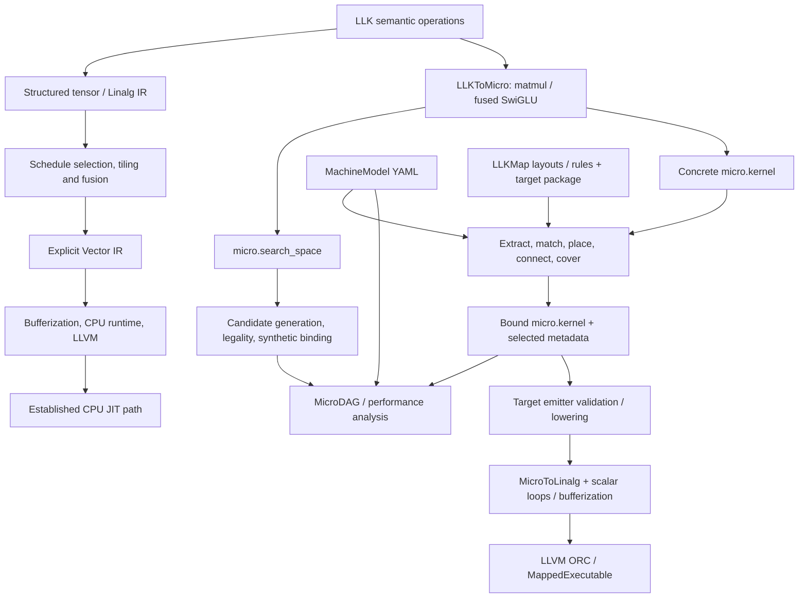

# Architecture

The compiler separates mathematical semantics, schedule choices, machine facts,
and target implementation. It uses MLIR's existing tensor, Linalg, Vector, SCF,
memref, and LLVM infrastructure, plus a small semantic `llk` dialect and the
canonical execution `micro` dialect.

This page explains the current component boundaries. Start with
[concepts](concepts.md) if tiles, owners, or search spaces are unfamiliar.
For runnable commands, use [getting started](getting-started.md) and the
[tool guides](README.md).

## Two CPU compilation paths

The established LLK/Linalg CPU path and the newer mapped MicroIR path coexist.
They share infrastructure but do not yet provide the same execution guarantees.

The upper path is the existing CPU validation pipeline: tensor optimizations,
explicit vectorization, bufferization, runtime dispatch, and LLVM lowering. The
lower path maps MicroIR and can execute supported kernels through a portable
Linalg-based lowering. Its numerical tests establish portable correctness on
their fixtures; they do not establish selected AVX2 vector-width or ISA
realization. That distinction is central to the current [feature limits](features.md).

The routes have different semantic coverage. Fused SwiGLU supports the legacy
LLK-to-Linalg conversion; `llk.matmul` is left untouched by that pass and uses
Micro export plus mapped compilation. RoPE and attention use the established
CPU path and are not current `LLKToMicro` export roots.

The search branch currently evaluates synthetic candidate kernels. The diagram
does not imply that `llk-tune` maps, replays, and compiles the original source for
every candidate. That integration is planned.

## Components and ownership

| Component | Responsibility | Start reading here |
|---|---|---|
| LLK dialect | Domain operations, assumptions and specialization metadata | [LLKOps.td](../include/LLK/Dialect/LLKOps.td), [LLKOps.cpp](../lib/Dialect/LLK/LLKOps.cpp) |
| Micro dialect | Tile types, canonical execution/search operations, structural verification | [MicroOps.td](../include/LLK/Dialect/Micro/MicroOps.td), [MicroOps.cpp](../lib/Dialect/Micro/MicroOps.cpp) |
| LLK conversions | Semantic-to-Linalg lowering and supported Micro export | [LLKToLinalg.cpp](../lib/Conversion/LLKToLinalg/LLKToLinalg.cpp), [LLKToMicro.cpp](../lib/Conversion/LLKToMicro/LLKToMicro.cpp) |
| CPU transforms | Scheduling, tiling, fusion, vectorization, packing and dispatch | [transforms](../lib/Transforms/), [schedule loader](../lib/Transforms/Common/ScheduleLoader.cpp) |
| `LLKMachine` | Topology, validation, queries and model hash | [MachineModel.h](../include/LLK/Machine/MachineModel.h), [loader](../lib/Machine/MachineModelLoader.cpp) |
| `LLKMapping` | Workload graph, declarative matching, placement, routing, search, plan data and verification | [mapping interfaces](../include/LLK/Mapping/), [mapping implementation](../lib/Mapping/) |
| `LLKTargetMapping` | Target factories, policy files and emitter behavior | [target packages](../lib/Target/), [mapping policy](../mapping/) |
| `LLKMicroMapping` | MLIR pass adapters and canonical plan materialization | [MicroMapping](../lib/Conversion/MicroMapping/) |
| `LLKPerf` | Search candidate analysis, MicroDAG, model estimates and tuning core | [performance interfaces](../include/LLK/Perf/), [implementation](../lib/Perf/) |
| `LLKMappedCompilation` | Bind, verify, target-lower, lower to executable form | [MappedCompilation.cpp](../lib/Conversion/MicroMapping/MappedCompilation.cpp) |
| Runtime | JIT lifetime, descriptor invocation, cache, packed weights and thread pool | [runtime](../runtime/), [MappedExecutable.h](../include/LLK/Runtime/MappedExecutable.h) |

Root [CMakeLists.txt](../CMakeLists.txt) owns most library and test registrations.
The tools are integration drivers: [compiler](tools/compiler.md),
[optimizer](tools/optimizer.md), [performance analyzer](tools/performance.md),
[tuner](tools/tuning.md), and [benchmark](tools/benchmark.md).

## Mapping from a kernel to a selected plan

Mapping consumes a concrete kernel plus a target. The phases have explicit data
models so a contributor can inspect one decision at a time:

| Phase | Input → output | Decision made |
|---|---|---|
| Extract | `micro.kernel` → `WorkloadGraph` | Nodes, value edges, boundary ports and source associations |
| Match | Graph + rules → `MappingCandidate` | Which single operation or bounded fused group a rule covers |
| Place | Candidate + topology/layouts → `CandidateInstance` | Executor, compute, memory and solved layout choices |
| Connect | Producer/consumer instances → connection alternatives | Direct use, routes, transforms or combined movement |
| Cover | Instances/connections → `CoveringPlan` | A coherent selection covering the workload |
| Bind | Source + plan → cloned mapped module | Persist selections and materialize required movement/sync |
| Verify | Mapped module + target → diagnostics | Structure, referenced facts and selected semantic consistency |

The main interfaces are [WorkloadGraph.h](../include/LLK/Mapping/WorkloadGraph.h),
[MappingRules.h](../include/LLK/Mapping/MappingRules.h),
[Placement.h](../include/LLK/Mapping/Placement.h),
[CoveringSearch.h](../include/LLK/Mapping/CoveringSearch.h), and
[PlanBinder.h](../include/LLK/Mapping/PlanBinder.h).

Search supports deterministic, beam, and exact modes with configurable bounds.
Beam search is an exploration heuristic. Exact search explores its bounded
candidate/connection space, but the current final-storage check occurs after
top-K retention and can lose a more expensive feasible plan. Do not interpret
the mode name as a complete physical-feasibility or global-optimality guarantee.

The binder clones the source instead of modifying it in place. It stores
`micro.plan`, per-operation `micro.mapping`, and `micro.routes`, then delegates
canonical movement construction to a materializer. Copies can carry value and
destination-node provenance. A partial binding records unmaterialized decisions;
the executable contract rejects those decisions. Current storage-fact bypasses
and incomplete compute persistence mean that this contract still needs the
repairs documented under issue #129.

## Machine facts and target policy

MachineModel v2 is a topology of executor, memory, compute, and transfer nodes.
Containment and dominance describe hierarchy/visibility; attachment places
capabilities at executors; directed links describe legal memory movement.
Concrete node IDs distinguish two same-kind resources. Profiles can also declare
owner refinements, coordinates, concurrency, and explicit executor equivalence.

LLKMap supplies target policy:

- **Layouts** declare finite parameter domains, constraints, canonical-kind
  bridges, and optional affine logical-to-physical maps.
- **Rules** match operation/port facts, require capabilities and layouts, declare
  boundary ports, and select opaque bundles and emitter keys.
- **Bundles and emitters** belong to the target. Generic code may persist and
  compare them but must not interpret their spelling as target behavior.

The shipped packages are [x86-avx2](../mapping/x86-avx2/) and
[generic-ai-accel](../mapping/generic-ai-accel/), with corresponding
[machine profiles](../machines/). The generic accelerator demonstrates mapping
onto an accelerator-shaped topology; it does not execute accelerator hardware.
See the [formal LLKMap syntax](design/llkmap-syntax.md) and its
[EBNF](design/llkmap.ebnf) when authoring policy.

## Library boundaries to preserve

`LLKMachine` supplies data and queries. `LLKMapping` builds generic mapping
decisions above it. `LLKPerf` consumes mapping cost/event primitives, so the
dependency direction is `LLKPerf → LLKMapping`, not the reverse. JIT and runtime
dependencies belong in the compilation/integration layer. A new analysis feature
must not make the generic mapping library depend on the performance analyzer or
runtime.

Generic [lib/Mapping](../lib/Mapping/) and [lib/Machine](../lib/Machine/) must not
branch on a target name. New target policy belongs in YAML, LLKMap, or a
[target package](../lib/Target/). Canonical ODS also remains free of backend owner
vocabulary: an owner/map symbol is resolved through a profile, and concrete IDs
belong in selected metadata.

## Performance and execution boundaries

The performance analyzer turns concrete operations and structural scopes into a
MicroDAG, work/byte estimates, dependencies and resource events. Level 0 supplies
static bounds; level 1 adds resource scheduling. Mapping also uses cost events
and a scheduler to compare plans. Shared primitives are useful, but current
planner and bound-kernel costs are not fully equivalent; named DMA occupancy and
physical-storage accounting also have known defects.

Mapped compilation runs plan binding, mapped verification, target emitter
lowering, then `MicroToLinalg` and backend passes. It offers intermediate stopping
points for inspecting mapped MicroIR and target-lowered/lowered forms.
`MappedExecutable` owns an ORC JIT and calls its wrapper through descriptor
pointers. The current path lowers supported work to scalar Linalg loops and uses
the native host; a selected vector layout can be lost at the tile-to-tensor
conversion. Compiler-allocated buffer release and typed descriptor validation
are also unfinished contracts.

These are active extension areas, not reasons to conflate analysis with target
execution. Read the [current assessment](reviews/2026-10-07-issue67-current-gap-assessment.md)
for reproduced cases and the [#129 plan](superpowers/plans/2026-10-07-issue129-gap-closure.md)
for proposed repairs. Measurement persistence and calibrated prediction remain
the separate #51/#52 workstream.

For the established CPU pipeline's detailed scheduling and runtime design, see
[ARCHITECTURE.md](../ARCHITECTURE.md). For the normative mapping design, see
[the September 18 specification](superpowers/specs/2026-09-18-microir-inspired-dslcompiler-enhancement-design.md).
Those documents include design goals and historical status; use
[features](features.md) for the current community-facing capability summary.
