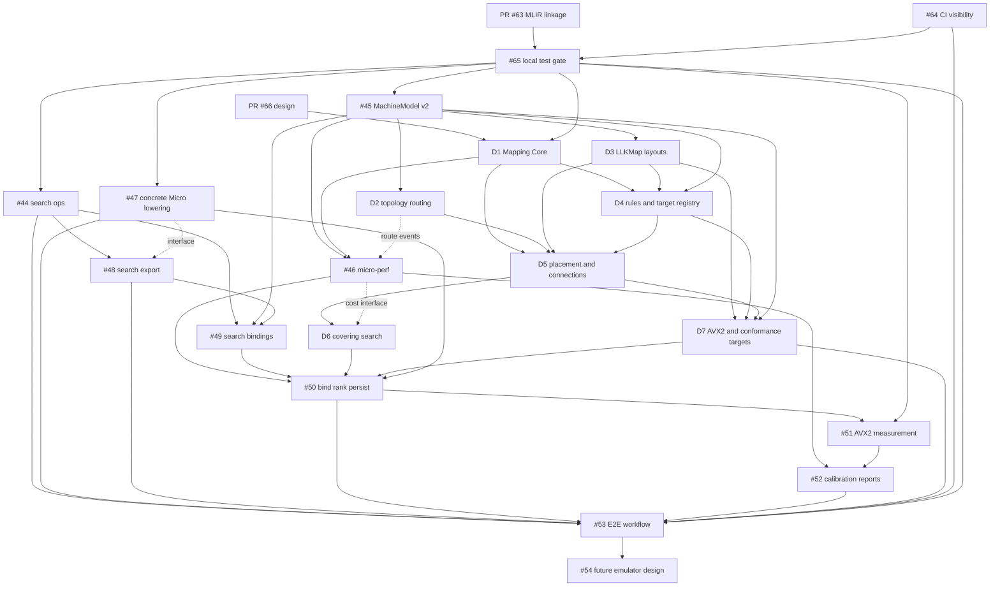

# Issue #67 Implementation Dependency Plan

> **For agentic workers:** REQUIRED SUB-SKILL: Use superpowers:subagent-driven-development (recommended) or superpowers:executing-plans to implement this plan task-by-task. Steps use checkbox (`- [ ]`) syntax for tracking.

**Goal:** Sequence the open DSLCompiler issues and the additional work introduced by issue #67 into independently reviewable implementation tracks with explicit merge, API, and validation dependencies.

**Architecture:** Keep `micro` as the canonical execution IR, preserve search intent in MLIR, and implement mapping mechanics in new `LLK/Machine` and `LLK/Mapping` libraries. Machine topology, layouts, rules, placement, connections, covering search, performance evaluation, and target emission are separate layers joined by stable interfaces.

**Tech Stack:** C++20, MLIR/LLVM 24 development build, TableGen/ODS, LLVM YAML I/O, MLIR affine maps, CMake/Ninja, GoogleTest, FileCheck, YAML/JSON reports.

**Spec:** `docs/superpowers/specs/2026-09-18-microir-inspired-dslcompiler-enhancement-design.md`

## Global Constraints

- Do not introduce a second canonical SemanticIR-like dialect.
- Do not add a build-time or source dependency on the MicroIR reference repository.
- Keep target-specific layouts, warp counts, TTGIR encodings, NPU fields, and ISA details outside generic Micro ODS definitions.
- Keep `!micro.tile` ownership abstract; bind concrete executor IDs in selected-plan metadata.
- Store durable search intent and complete parameter bindings in MLIR; keep search frontiers and partial plans in C++.
- Use deterministic IDs, iteration order, diagnostics, serialization, and tie-breaking throughout.
- Use a finite-domain deterministic layout solver initially; do not require an SMT dependency.
- Keep the legacy AVX2 compilation/JIT path available until the new path passes end-to-end validation.
- Develop every code slice with a failing test first and end it with a focused commit.
- Treat issue #67 as an epic. Each new subsystem below receives its own child issue and detailed implementation plan before code changes begin.

---

## 1. Planning Snapshot

This plan reviews the complete open-issue set as of 2026-09-18:

```text
#41, #44-#54, #64, #65, #67
```

Relevant open pull requests are:

- #63: correct MLIR dylib/component linkage;
- #66: add the design implemented by this dependency plan;
- #62: update repository guidance for the Micro-IR direction.

Closed issues #42 and #43 already provide the Micro dialect foundation and concrete tile execution operations. Issue #41 still shows #43 as unchecked and must be corrected when its dependency section is updated.

### 1.1 Dependency kinds

This plan uses three dependency kinds:

- **Hard:** the producer must merge before the consumer can merge.
- **Interface:** work may proceed in parallel after the interface is agreed, but the consumer cannot integrate until the producer lands.
- **Validation:** no API dependency exists, but the test or CI gate must be effective before relying on the result.

---

## 2. Open-Issue Review

| Issue | Current role | Dependency assessment | Required action |
|---|---|---|---|
| #41 | Parent M9-M13 roadmap | Correct overall order but predates #67 and has stale #43 status | Mark #43 complete, add #67, add test-infrastructure gates, and replace direct #49-to-#50 edge with the mapping workstreams below |
| #44 | Persistent Micro search ops | Earliest product dependency for #48 and #49; correctly excludes algorithms | Keep scope unchanged; land after Micro/FileCheck tests are visible and reliable |
| #45 | MachineModel YAML and loader | Hard foundation for routing, layouts, rules, performance, legality, and placement | Revise from `LLK/Perf` flat data into versioned `LLK/Machine` topology; keep loading/validation in this issue and move routing to a child issue |
| #46 | Micro DAG and performance evaluator | Needs #45 and the shared workload/cost contracts; feeds #50, #52, and covering ranking | Reuse the workload graph and cost/event types from Mapping Core; account for every selected route hop |
| #47 | LLK/Linalg to concrete Micro lowering | Independent producer of realistic `micro.kernel`; needed for production integration and E2E | Run in parallel with #44/#45/Mapping Core after the test gate; preserve the current JIT path |
| #48 | Search-space export | Hard dependency on #44; interface-aligned with #47 and schedule schema | Develop after #44; coordinate workload identity and schedule fields with #47, but do not require #47 to finish first |
| #49 | Search loading, generation, legality | Current scope conflates full parameter bindings with internal mapping candidates | Restrict to `SearchBinding`, deterministic grid/random enumeration, and binding-level checks; delegate topology/layout/placement/covering legality to new mapping child issues |
| #50 | Candidate binding, ranking, YAML | Current direct candidate-to-kernel model is superseded by #67 | Bind a selected `CoveringPlan`; consume #46 ranking and the AVX2 target package; preserve schedule compatibility through an adapter |
| #51 | AVX2 measurement | Correctly late; also depends on reliable host feature gating | Start only after #50 and the architecture-aware portions of #65 |
| #52 | Calibration and validation reports | Depends on both predicted and measured records | Start after #46 and #51; implement the `LatencyProvider` cache adapter without changing legality |
| #53 | E2E documentation and tests | Final MVP integration issue | Expand fixtures to include transform, two-hop route, stable plan report, and target-separation checks; land after all MVP mapping tracks |
| #54 | Functional emulator design | Explicitly outside the performance/tuning critical path | Leave unscheduled until #53 and concrete mapped Micro semantics are stable |
| #64 | CI test visibility | Validation prerequisite for all new FileCheck-heavy work | Complete before merging #44 so new dialect regressions cannot be silently skipped |
| #65 | Canonical local test gate | Umbrella for `check-llk`, current failures, and host skips | Establish staged gates: canonical target and Micro tests first, host-aware AVX2 skips before #51, full applicable suite before #53 |
| #67 | Enhancement epic | Coordinates the new topology-aware mapping architecture | Do not implement as one PR; create and track the seven child workstreams in Section 4 |

### 2.1 Open-issue conclusions

1. #44, #45, #47, and Mapping Core can form the first product wave after the test gate.
2. #46 must not invent a separate graph, resource, route, or cost vocabulary.
3. #49 remains the outer search-binding enumerator; it is not the mapping-cover search.
4. #50 is the convergence point for search binding, covering, target configuration, and performance ranking.
5. #54 is not a dependency of #67 and must not consume MVP capacity.

---

## 3. Repository Boundaries

### 3.1 Existing files that anchor the work

```text
include/LLK/Dialect/Micro/MicroDialect.td
include/LLK/Dialect/Micro/MicroTypes.td
include/LLK/Dialect/Micro/MicroOps.td
lib/Dialect/Micro/MicroDialect.cpp
lib/Dialect/Micro/MicroOps.cpp

include/LLK/Transforms/Common/ScheduleLoader.h
lib/Transforms/Common/ScheduleLoader.cpp
tools/llk-opt/llk-opt.cpp
tools/llk-compile/llk-compile.cpp
tools/llk-tune/llk-tune.cpp
CMakeLists.txt
```

Current `ScheduleEntry` only stores numeric tile, vector, thread, grain, and parallel-axis choices. Current `llk-tune` owns a local `TuningConfig`, hard-coded AVX2-like domains, a fixed 32 KiB L1 filter, and JSON output. These structures are migration inputs, not the final mapping architecture.

### 3.2 New generic ownership boundaries

```text
include/LLK/Machine/
  MachineModel.h
  MachineModelLoader.h
  Topology.h
lib/Machine/
  MachineModel.cpp
  MachineModelLoader.cpp
  Topology.cpp

include/LLK/Mapping/
  SearchBinding.h
  WorkloadGraph.h
  MappingPlan.h
  LayoutConstraints.h
  MappingRules.h
  Routing.h
  Placement.h
  CoveringSearch.h
  CostModel.h
  MappingTarget.h
lib/Mapping/
  corresponding implementation files

machines/
  x86-avx2-cpu.yaml
  generic-ai-accel-v1.yaml
mapping/
  x86-avx2/layouts.llkmap
  x86-avx2/rules.llkmap
```

`LLK/Machine` owns target facts. `LLK/Mapping` owns target-independent planning. `LLK/Perf` consumes mapped events and provides predictions/calibration. Target packages own layouts, rules, bundles, and emitters.

---

## 4. New Child Workstreams for #67

The following named child issues must be created before implementation. Names are stable references in this plan until GitHub issue numbers are assigned.

### D1: Mapping Core Data Model and Workload Graph

**Scope:** Stable IDs, `SearchBinding`, `WorkloadGraph`, `MappingCandidate`, `CandidateInstance`, `ConnectionPlan`, `CoveringPlan`, multi-dimensional `Cost`, canonical hashing, and deterministic ordering.

**Files:**

- Create: `include/LLK/Mapping/SearchBinding.h`
- Create: `include/LLK/Mapping/WorkloadGraph.h`
- Create: `include/LLK/Mapping/MappingPlan.h`
- Create: `include/LLK/Mapping/CostModel.h`
- Create: matching `lib/Mapping/*.cpp`
- Test: `test/Mapping/workload_graph.cpp`
- Test: `test/Mapping/mapping_plan.cpp`

**Consumes:** Closed #43 concrete Micro ops and hand-written `micro.kernel` fixtures.

**Produces:** Stable interfaces consumed by #46, D4, D5, D6, #49, and #50.

**Hard dependencies:** PR #66 merged; targeted Micro tests from #65 green.

**Merge criterion:** Identical graphs and plans built from different insertion orders produce identical IDs and serialized ordering.

### D2: Machine Topology Routing

**Scope:** `RouteRequest`, `MemoryRoute`, deterministic bounded route enumeration, link/engine validation, visibility, intermediate capacity, and route diagnostics.

**Files:**

- Create: `include/LLK/Mapping/Routing.h`
- Create: `lib/Mapping/Routing.cpp`
- Modify: `include/LLK/Machine/Topology.h`
- Test: `test/Mapping/routing.cpp`

**Consumes:** #45 normalized topology and stable machine node/link IDs.

**Produces:** Route alternatives consumed by D5, #46, and the plan binder in #50.

**Hard dependencies:** #45.

**Merge criterion:** Direct and multi-hop fixtures are cycle-free and ordered by cost, hop count, then link-ID sequence.

### D3: LLKMap Layout Constraints

**Scope:** LLKMap lexer/parser for layout declarations, typed expression model, finite-domain solver, affine maps, MachineModel queries, layout registry, and AVX2 examples.

**Files:**

- Create: `include/LLK/Mapping/LayoutConstraints.h`
- Create: `lib/Mapping/LayoutConstraints.cpp`
- Create: `mapping/x86-avx2/layouts.llkmap`
- Test: `test/Mapping/layout_constraints.cpp`
- Test: `test/Mapping/Inputs/invalid-layouts.llkmap`

**Consumes:** #45 capability query API and MLIR affine infrastructure.

**Produces:** Concrete target layout alternatives consumed by D4 and D5.

**Hard dependencies:** #45.

**Merge criterion:** Positive and negative layout fixtures solve deterministically without target-specific branches in Micro ODS/verifiers.

### D4: LLKMap Mapping Rules and Target Registry

**Scope:** One-op matching, explicit ports, typed requirements, opaque target bundles, emitter keys, rule validation, and `MappingTarget` registration.

**Files:**

- Create: `include/LLK/Mapping/MappingRules.h`
- Create: `include/LLK/Mapping/MappingTarget.h`
- Create: `lib/Mapping/MappingRules.cpp`
- Create: `mapping/x86-avx2/rules.llkmap`
- Test: `test/Mapping/mapping_rules.cpp`
- Test: `test/Mapping/Inputs/invalid-rules.llkmap`

**Consumes:** D1 workload/plan types, D3 layout registry, and #45 machine capability queries.

**Produces:** `MappingCandidate` objects and target bundle descriptors consumed by D5 and the target integration workstream D7.

**Hard dependencies:** D1, D3, #45.

**Merge criterion:** Unknown operations, layouts, queries, emitters, unbound parameters, invalid maps, and duplicate rule IDs fail at load time with stable diagnostics.

### D5: Placement and Connection Synthesis

**Scope:** Executor/memory/layout placement enumeration, resource-use checks, symmetry reduction, direct/transform/transfer/multi-hop connections, fan-out replication, and fan-in aggregation.

**Files:**

- Create: `include/LLK/Mapping/Placement.h`
- Create: `lib/Mapping/Placement.cpp`
- Test: `test/Mapping/placement.cpp`
- Test: `test/Mapping/connections.cpp`

**Consumes:** D1 data model, D2 routes, D3 layouts, D4 rule candidates, and #45 topology.

**Produces:** Legal `CandidateInstance` and `ConnectionPlan` alternatives consumed by D6.

**Hard dependencies:** D1, D2, D3, D4.

**Merge criterion:** Fixtures cover direct, transform-only, transfer-only, transfer-plus-transform, two-hop, shared-read, and replication cases.

### D6: Deterministic, Beam, and Exact Covering Search

**Scope:** Partial-plan state, exact coverage, lazy connection selection, resource accounting, deterministic mode, beam mode, exact branch-and-bound mode, caps, truncation reporting, and failure frontiers.

**Files:**

- Create: `include/LLK/Mapping/CoveringSearch.h`
- Create: `lib/Mapping/CoveringSearch.cpp`
- Test: `test/Mapping/covering_search.cpp`

**Consumes:** D1 plan/cost contracts and D5 placed/connected alternatives.

**Produces:** Ranked complete `CoveringPlan` candidates consumed by #50.

**Hard dependencies:** D1 and D5.

**Interface dependency:** #46 supplies final production cost evaluation; D6 initially uses declared lower bounds and deterministic fixture costs.

**Merge criterion:** Exact and sufficiently wide beam search select the same best plan on bounded fixtures; every cap produces explicit `search_truncated` metadata.

### D7: AVX2 Mapping Target and Second-Target Conformance

**Scope:** AVX2 `MappingTarget`, machine/layout/rule package, bundle validation, emitter handoff, legacy-path compatibility, and a minimal generic-accelerator conformance target.

**Files:**

- Create: `include/LLK/Target/AVX2/Mapping/AVX2MappingTarget.h`
- Create: `lib/Target/AVX2/Mapping/AVX2MappingTarget.cpp`
- Modify: `machines/x86-avx2-cpu.yaml`
- Modify: `machines/generic-ai-accel-v1.yaml`
- Modify: `mapping/x86-avx2/layouts.llkmap`
- Modify: `mapping/x86-avx2/rules.llkmap`
- Test: `test/Mapping/avx2_target.cpp`
- Test: `test/Mapping/generic_accelerator_target.cpp`

**Consumes:** #45, #46, D3, D4, D5, and D6 interfaces.

**Produces:** The first complete target configuration consumed by #50 and the target-separation evidence consumed by #53.

**Hard dependencies:** #45, D3, D4, D5.

**Interface dependencies:** #46 and D6.

**Merge criterion:** Both targets load and map bounded fixtures without adding target-specific enumerants or fields to generic Micro ODS.

---

## 5. Dependency Graph



Dashed edges are interface coordination, not strict start-order dependencies.

---

## 6. Delivery Waves

### Wave 0: Make verification trustworthy

**Can run in parallel:** PR #66 review and PR #63 review.

- [ ] Merge PR #66 so the governing design is on `main`.
- [ ] Merge or supersede PR #63 so `llk-opt` links one MLIR implementation.
- [ ] Complete #64 so CI builds/locates compatible FileCheck and reports missing suites as a failure.
- [ ] Complete the first #65 checkpoint: add one canonical `check-llk` target and make Micro dialect parse/print/invalid tests green.
- [ ] Update #41 to mark #43 complete and reference #67, #64, and #65.

**Exit gate:** A deliberately broken Micro verifier test fails locally and in CI through the same documented command.

### Wave 1: Establish independent foundations

**Can run in parallel after Wave 0:** #44, #45, #47, and D1.

- [ ] Implement #44 without target-aware legality.
- [ ] Implement #45 as a normalized topology graph and loader under `LLK/Machine`.
- [ ] Implement #47 against the already-closed concrete Micro op set.
- [ ] Implement D1 with hand-written Micro fixtures.

**Exit gate:** Search IR round-trips; both machine profiles load; representative LLK/Linalg emits concrete Micro; a Micro kernel extracts to a stable workload graph.

### Wave 2: Add route, layout, performance, and search export semantics

**Can run in parallel:** D2, D3, #46, and #48 after their individual prerequisites land.

- [ ] Implement D2 after #45.
- [ ] Implement D3 after #45.
- [ ] Implement #46 after #45 and D1 interfaces are stable.
- [ ] Implement #48 after #44, coordinating schedule identity with #47.

**Exit gate:** A hand-written kernel has a deterministic event graph, direct/two-hop routes, solved AVX2 layouts, and a corresponding persistent search space.

### Wave 3: Generate legal placed alternatives

- [ ] Implement D4 after D1, D3, and #45.
- [ ] Implement #49 after #44, #45, and #48, using `SearchBinding` naming.
- [ ] Implement D5 after D2, D3, and D4.

**Parallelism:** #49 can proceed in parallel with D4/D5 because it owns outer parameter bindings, not mapping candidates.

**Exit gate:** One search binding expands into stable rule candidates, placed instances, and connection alternatives with actionable rejection diagnostics.

### Wave 4: Select and materialize complete plans

- [ ] Implement D6 after D5.
- [ ] Implement D7 against stable target, placement, and cost interfaces.
- [ ] Revise and implement #50 after #46, #47, #49, D6, and D7.

**Parallelism:** D6 search algorithms and D7 target data can proceed concurrently once their interfaces are frozen.

**Exit gate:** `llk-tune` selects top-K complete plans deterministically, binds the winner to concrete Micro-IR, and writes versioned schedule YAML plus a plan report.

### Wave 5: Measure and calibrate

- [ ] Complete the architecture-aware #65 checkpoint so AVX2-only tests skip explicitly on unsupported hosts.
- [ ] Implement #51 after #50.
- [ ] Implement #52 after #51 and #46.

**Exit gate:** Predicted-only remains the default; optional supported-host measurement produces reproducible calibration records and validation reports.

### Wave 6: Close the MVP

- [ ] Complete #53 after all prior MVP tracks.
- [ ] Complete the full applicable #65 suite and retain #64 CI visibility.
- [ ] Update #41 and #67 checklists from verified evidence.
- [ ] Defer #54 until the mapped Micro semantics are stable in released examples.

**Exit gate:** A contributor can follow one documented workflow from LLK/Linalg through search export, mapping, ranking, binding, performance evaluation, and optional AVX2 measurement.

---

## 7. Critical Paths

### 7.1 Mapping critical path

```text
PR #66
  -> #45 MachineModel v2
  -> D3 LLKMap layouts
  -> D4 mapping rules/target registry
  -> D5 placement/connections
  -> D6 covering search
  -> #50 binding/ranking/persistence
  -> #51 measurement
  -> #52 calibration
  -> #53 E2E
```

### 7.2 Persistent search critical path

```text
#64/#65 test visibility
  -> #44 search ops
  -> #48 search export
  -> #49 SearchBinding enumeration
  -> #50 binding/ranking/persistence
```

### 7.3 Concrete execution and cost critical path

```text
closed #43 concrete ops
  -> #47 concrete Micro lowering
  -> D1 workload graph
  -> #46 micro-perf
  -> #50 ranking
```

D1 does not need to wait for #47 to start because it can use hand-written kernels, but #47 must land before production integration and #53.

---

## 8. Required Issue Revisions Before Implementation

### Task 1: Align #41 with the actual repository state

- [ ] Mark #43 complete.
- [ ] Add #67 as the topology-aware mapping enhancement epic.
- [ ] Add #64/#65 as validation gates, not product milestones.
- [ ] Replace the direct `#46 + #49 -> #50` dependency with D1-D7 and the graph in Section 5.

### Task 2: Revise #45 into the MachineModel v2 foundation

- [ ] Change proposed ownership from `include/LLK/Perf` to `include/LLK/Machine`.
- [ ] Add executor, memory, compute, transfer-engine nodes and graph edges.
- [ ] Add stable IDs, versioning, content hashing, and normalized queries.
- [ ] Keep route enumeration out of #45 and point to D2.

### Task 3: Revise #46 to share graph and cost contracts

- [ ] Consume D1 `WorkloadGraph` and `Cost` rather than defining parallel types.
- [ ] Consume #45 resources and D2 route-hop events.
- [ ] Expose a prediction interface usable by D6 and #50.

### Task 4: Narrow #49 to outer search binding

- [ ] Rename the full parameter tuple from `Candidate` to `SearchBinding`.
- [ ] Keep deterministic grid and seeded random enumeration.
- [ ] Keep domain membership and binding-level constraint checks.
- [ ] Move layout, placement, routing, and covering legality to D3-D6.

### Task 5: Revise #50 around `CoveringPlan`

- [ ] Accept a source `SearchBinding` and ranked complete `CoveringPlan` objects.
- [ ] Materialize selected placements, routes, transforms, and bundles.
- [ ] Use #46 for objective ranking.
- [ ] Preserve existing schedule loading through an explicit compatibility adapter.

### Task 6: Expand #53 acceptance fixtures

- [ ] Add elementwise, tiled GEMM, fused multi-op, layout-transform, and two-hop-route examples.
- [ ] Verify deterministic plan reports and selected-plan IDs.
- [ ] Verify no target-specific vocabulary is required in generic Micro ODS.
- [ ] Verify the legacy AVX2 path remains unchanged when mapping is disabled.

---

## 9. Verification Matrix

| Producer | Required verification before consumers merge |
|---|---|
| #44 | Round-trip twice, invalid-domain/reference/binding cases, deterministic printing |
| #45 | Valid AVX2/generic profiles; duplicate/dangling/cycle/version/capacity failures |
| D1 | Stable IDs and serialization independent of insertion order |
| D2 | Direct and multi-hop routes; cycle freedom; stable ordering; missing-engine failures |
| D3 | Positive/negative layout solving; invalid queries/maps; no target branches in Micro ODS |
| D4 | Rule matching and all load-time rejection classes |
| D5 | Direct/transform/transfer/two-hop/fan-out/fan-in connections |
| D6 | Deterministic mode; beam/exact agreement; capacity pruning; truncation diagnostics |
| #46 | L0/L1 event totals; route-hop accounting; stable reports |
| #47 | Matmul and fused SwiGLU concrete Micro; legacy path unchanged |
| #48 | Numeric/symbolic search export and schedule compatibility |
| #49 | Deterministic grid/random bindings and stable rejection codes |
| D7 | AVX2 plus generic-accelerator mapping without generic ODS changes |
| #50 | No unresolved search ops; deterministic top-K; YAML/report round trip |
| #51 | Supported-host measurement and unsupported-host skip behavior |
| #52 | Calibration round trip and prediction-error report |
| #53 | Complete documented workflow and regression tests |

The canonical verification command must come from #65. Until #65 closes, every implementation PR records the exact configured test count, executed subset, failures, and skips; a green partial CTest result is insufficient.

---

## 10. Commit and Review Policy

Each issue or D-workstream is a separate branch and PR. Within a workstream:

1. commit failing tests or fixtures;
2. commit the smallest implementation that makes them pass;
3. commit tool/CMake registration when the library contract is stable;
4. commit documentation/config examples last;
5. request review before a downstream workstream merges against the interface.

Do not combine #45, D2, D3, or D4 in one PR. Their separation is what allows routing, layouts, and rules to evolve without turning MachineModel into a monolith.

---

## 11. Completion Criteria for #67

Issue #67 may close only when:

- #44-#53 are complete or their superseding issues are linked and complete;
- D1-D7 are complete;
- #64 and #65 provide trustworthy local and CI verification;
- AVX2 is a functioning mapping target and the legacy path remains available;
- a second target fixture maps without generic Micro ODS changes;
- search bindings, plans, routes, reports, and selected IR are deterministic;
- `micro-perf` and mapping use the same topology, route, event, and cost contracts;
- issue #53 demonstrates the complete documented workflow;
- #54 remains explicitly separate unless a later decision promotes functional emulation into the roadmap.
