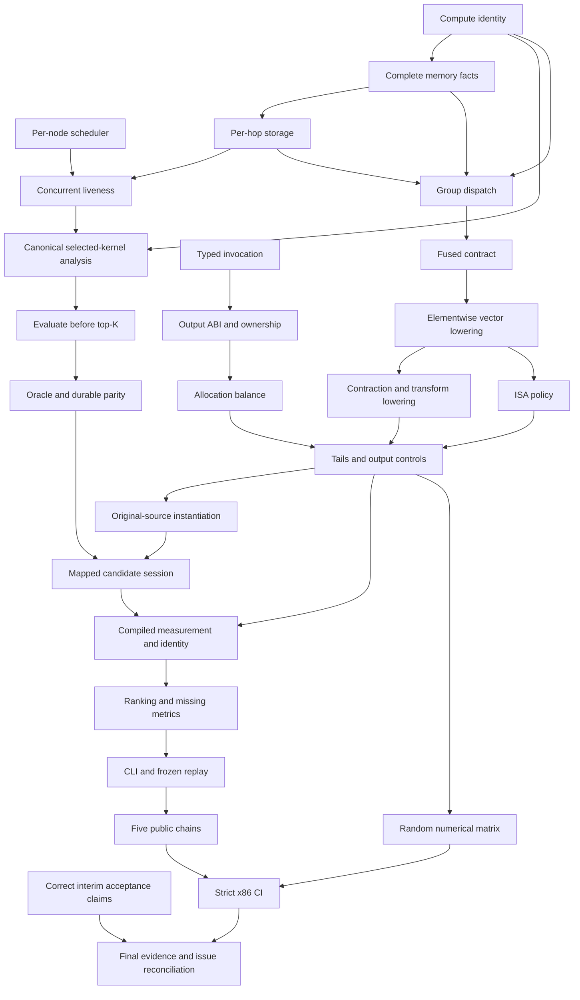

# Issue #129 Gap Closure Implementation Plan

> **For agentic workers:** REQUIRED SUB-SKILL: Use superpowers:subagent-driven-development (recommended) or superpowers:executing-plans to implement this plan task-by-task. Steps use checkbox (`- [ ]`) syntax for tracking.

**Goal:** Close the ten verified gaps in [issue #129](https://github.com/skg7on/DSLCompiler/issues/129) and supply evidence that the mandatory issue #67 design and A/B/C acceptance contracts hold.

**Architecture:** Keep Micro-IR canonical and target policy in target packages. Finalize, materialize and analyze every complete search proposal before it enters the retained top-K; the integration layer supplies this evaluation without reversing the mapping-to-perf dependency. Compile the exact selected instance groups through an explicit reference or selected-target backend, with a checked invocation contract and deterministic buffer ownership.

**Tech Stack:** C++20, LLVM/MLIR, LLKMapping/LLKMicroMapping/LLKPerf, Linalg/Vector/Bufferization, LLVM ORC, GTest, FileCheck, Python subprocess acceptance runners, CMake/Ninja/CTest.

**Spec:** [Normative design](../specs/2026-09-18-microir-inspired-dslcompiler-enhancement-design.md), especially §§5, 8–19, 25–29; [A/B/C improvement plan](2026-10-04-issue67-improvement-plan.md); [verified assessment](../../reviews/2026-10-07-issue67-current-gap-assessment.md); [issue #129](https://github.com/skg7on/DSLCompiler/issues/129). Earlier plans describe already-landed work; this plan repairs the remaining contracts rather than restarting those stages.

## Global Constraints

- “`micro` remains the only canonical execution IR.” (Spec §5.1.)
- “Target policy lives in target packages.” (Spec §5.4.)
- “The selected plan materializes placements, routes, transforms, and target bundle selections in concrete Micro-IR.” (Spec §29.8.)
- “Repeated runs with identical inputs and configuration produce byte-identical normalized IR and plan reports.” (Spec §29.12.)
- “Existing LLK-to-AVX2 lowering remains the default until end-to-end correctness and performance validation meet roadmap criteria.” (Spec §26.1.)
- No functional emulator, accelerator hardware execution, general SMT solver, production measurement database, calibration fitting or prediction-error target is required by this repair. The last two remain #51/#52.
- All writes use an isolated worktree under `.claude/worktrees/` and a `category/kebab-case` branch; follow `CLAUDE.md` and `.claude/rules/worktree-isolation.md`.
- Preserve `LLKPerf -> LLKMapping`; `LLKMapping` must not link LLKPerf, LLKRuntime or JIT libraries. Integration belongs above these libraries.
- Give new data fields default member initializers, use checked size arithmetic and deterministic ordering, and explicitly invalidate incompatible persisted state.
- Toolchain validation uses the repository's pinned Linux static LLVM **22.1.8** and the existing local LLVM **24.0.0git** build. These are validation baselines, not a new version-floor promise.

## Review Focus

1. A replay from a different target, graph, ABI or schema must fail before binding/JIT, even when resource names remain unchanged. R1/R8, E1 and T3/T5 pin this.
2. Two same-kind compute, memory or DMA nodes must keep distinct identities through search, storage, event scheduling, replay and lowering. R1–R4 and T6 pin this.
3. Loop trip count, simultaneously live pipeline stages and parallel owners must not be conflated; slot reuse must be ordered in both the plan and emitted IR. R4–R7 and T6 pin this.
4. Wrong descriptor rank/dtype/extent/stride/buffer range, aliased results and a returned input must never cause an invalid call, caller-buffer free or double free. E1–E3 and T7 pin this.
5. An unsupported host, dtype, emitter, fused region or tail policy must produce an honest diagnostic; reference execution cannot satisfy selected AVX2 acceptance. E4–E9 and T8 pin this.

---

## Baseline and plan status

This is a proposed implementation plan, written on **2026-10-07**. No production implementation is included. Reviewed main is `50b8fbeed84fead59956b50c3fb338267e0cbd89` (PR #127); open [PR #128](https://github.com/skg7on/DSLCompiler/pull/128) is `e1b6efc01e11cc5928d96603bf81c75e02e018dd`. The isolated planning branch is `docs/issue129-gap-closure-plan`, based on that PR head so its useful tuner fix and acceptance changes are accounted for. At execution, refresh main and #128; preserve the tuner fix if it has not merged, and resolve documentation against the then-current tree.

Previous assessment verification on the exact #128 head registered 139 CTests: 137 passed, two legacy SwiGLU tests skipped. Successful checks establish a baseline; they do not close the new regressions. New test counts, compiler versions and CI links must come from the repaired head, not from this plan.

## Read and execute these three companion plans

| Workstream | Plan | Deliverable | Tasks |
|---|---|---|---:|
| Resources and static scoring | [Resource/search/cost plan](2026-10-07-issue129-resources-and-costs.md) | Persistent compute identity, complete physical storage, correct resource scheduling, feasible exact top-K and planner/perf parity | R1–R8 |
| Execution and runtime | [Backend/runtime plan](2026-10-07-issue129-execution-and-runtime.md) | Typed ABI, deterministic scratch release, grouped fused lowering, explicit selected-width Vector IR and ISA-controlled execution | E1–E9 |
| Tuning and acceptance | [Tuner/acceptance plan](2026-10-07-issue129-tuning-and-acceptance.md) | Original-source candidate instantiation, shared mapped compilation/measurement, replayable CLI output, all five acceptance chains and truthful closure evidence | T0–T9 |

There are **27 reviewable tasks**. A task is a small independently reviewable deliverable, not an estimate that a backend or ownership change takes five minutes. Each checkbox is one action; larger implementation steps name the concrete sub-actions needed. Build/test setup belongs to its owning task. Do not introduce unrelated refactors.

## Worktree execution ledger (2026-10-11)

This ledger records the requested `feat/issue129-gap-closure` worktree without
mistaking local ARM64 evidence for the selected-x86 release gate. The worktree
started from `origin/feat/issue129-gap-closure` at `1a015c7`; the starting state
had T0 and R1–R8 complete. Implementation commits through `1c678de` and the
acceptance documentation through `149f260` are recorded below.

| Task | Verified implementation record | Current disposition |
|---|---|---|
| **T0, R1–R8** | Present at the `1a015c7` worktree base; starting status records R8 complete | Complete at base |
| **E1** | `813979e` typed invocation validation | Implemented; local ABI tests pass |
| **E2** | `6c4045b` output preparation before deallocation | Implemented; local preparation tests pass |
| **E3** | `aef1219` deterministic scratch lifetime | Implemented; lifetime tests pass locally |
| **E4** | `f493fa7` selected-instance grouping and context | Implemented; `SelectedGroupLoweringTest` passes |
| **E5** | `63809bf` fused bundle layout and group outputs | Implemented; fused lowering tests pass |
| **E6** | `267b44f` selected widths in Vector IR | Implemented; width-4/8 codegen checks pass |
| **E7** | `6dda506` selected contractions and physical layouts | Implemented; mapped codegen checks pass |
| **E8** | `b365fbd` target ISA requirements and execution identity | Implemented; requirement/policy tests pass |
| **E9** | `d100062` bounded tails and multiple outputs | Implemented; portable numeric controls pass |
| **T1** | `d850c2e` original-source candidate instantiation | Implemented; `CandidateInstantiationTest` passes |
| **T2** | `4f3a0db` selected mapped compilation | Implemented; `MappedTuningSessionTest` passes |
| **T3** | `0377ab4` selected executable measurement identity | Implemented; tuning-session tests pass |
| **T4** | `8d31c12` missing metrics stay out of ranking | Implemented; tuning-session tests pass |
| **T5** | `d696879` CLI report and frozen replay | Implemented; replay and CLI tests pass |
| **T6** | `5d9a574` five public acceptance chains | Verified; all five chains pass locally |
| **T7** | `0929b53`, `abfcb3b` randomized tails, transforms and multiple outputs | Verified on portable backend: 8 pass, 2 AVX2 cases skip |
| **T8** | `cce2c6e`, `1c678de` strict selected-target CLI, evidence parser, injected unsupported-feature control and CI artifact capture; local legacy skip investigation recorded in tuning plan | Harness and local legacy skip reasons verified; selected-x86 run, static LLVM22 link gate and CI legacy outcomes remain open |
| **T9** | `d48a46d` smoke negative controls; `106a1dc`, `841e193`, `118b267`, `149f260` matrix, branch status and G1–G10 crosswalk | Steps 1–3 verified; final CI proof, GitHub checklist reconciliation and release-head review remain open |

At `1c678de`, the full local build succeeded and CTest registered 161 tests:
157 passed, three skipped, and `MappedAVX2Acceptance` failed because the host
is Darwin arm64. The required-execution parser rejected that report as intended.
The current suite therefore verifies the fail-closed gate, not selected-x86
acceptance. The candidate matrix and local toolchain record are in
[`docs/reviews/issue67-final-acceptance.md`](../../reviews/issue67-final-acceptance.md).

## File and dependency boundaries

| Area | Existing files to modify | New focused files | Responsibility |
|---|---|---|---|
| Selected state | `MappingPlan.h/.cpp`, `MappingMetadata.cpp`, `PlanReport.cpp`, `CoveringSearch.cpp`, `PlanVerification.cpp`, `LatencyProvider.cpp` | None required | Persist complete selections and version their identity |
| Physical execution | `StoragePlan.cpp`, `PlanMaterialization.cpp`, `EventSchedule.cpp` | `include/LLK/Mapping/StorageLiveness.h`, `lib/Mapping/StorageLiveness.cpp` | Per-hop allocations, event-based lifetimes, ordered reuse and capacity |
| Complete-plan evaluation | `CoveringSearch.h/.cpp`, `MicroMappingCommon.h`, `MicroDAG.cpp`, `MicroCostModel.cpp`, `MicroPerfReport.cpp` | `include/LLK/Conversion/MicroMapping/CompletePlanEvaluation.h`, `lib/Conversion/MicroMapping/CompletePlanEvaluation.cpp`, `include/LLK/Perf/SelectedKernelAnalysis.h`, `lib/Perf/SelectedKernelAnalysis.cpp` | Canonical preview, one normalized analysis, final score before retention |
| ABI/ownership | `MappedExecutable.h/.cpp`, `MappedCompilation.cpp`, `JitCache.cpp` | `include/LLK/Runtime/MappedInvocation.h`, `runtime/MappedInvocation.cpp`, `include/LLK/Conversion/MappedKernelAbi.h`, `lib/Conversion/MicroMapping/MappedKernelAbi.cpp` | Typed invocation validation; output parameters before deallocation; shared preparation |
| Selected backend | `MappingTarget.h`, `MappingLowering.h`, `MappedCompilation.h/.cpp`, `AVX2BundleLowering.cpp`, `MicroToLinalg.cpp`, target rules/layouts/profile | `include/LLK/Target/X86/Mapping/AVX2BackendLowering.h`, `lib/Target/X86/Mapping/AVX2BackendLowering.cpp` | Target-owned vectorization, fused groups, code-generation requirements |
| Source instantiation | `LLKToMicro.cpp`, `CandidateBinding.cpp`, loader interfaces | `include/LLK/Conversion/MicroMapping/CandidateInstantiation.h`, `lib/Conversion/MicroMapping/CandidateInstantiation.cpp` | Apply a complete binding to the original source, preserving semantics |
| Mapped tuning | `llk-tune.cpp`, schedule adapter, metric validation | `include/LLK/Conversion/MappedTuningSession.h`, `lib/Conversion/MicroMapping/MappedTuningSession.cpp`, `test/Tuning/mapped_tuning_session.cpp` | Orchestrate mapping and optional compilation above perf/runtime |
| Acceptance | `acceptance_pipeline.py`, `mapped_acceptance.cpp`, root `CMakeLists.txt`, CI and docs | Focused fixtures, `test/Execution/mapped_avx2_acceptance.cpp`, `test/Docs/workflow_smoke.py` | Substantive public-chain assertions and non-skipped selected-target evidence |

Paths above are repository-relative. Root `CMakeLists.txt` owns library and test registrations; the listed source directories do not have their own CMakeLists files. New tests use existing `add_llk_mapping_test` / `add_llk_perf_test` patterns when their dependencies fit; integration tests explicitly link LLKMicroMapping or LLKMappedCompilation.



R2 and E1–E3 can start independently of compute persistence. T1's source-adapter extraction can start from existing APIs, but its full supported tail contract depends on E9. Shared files (`MappingPlan.h`, `MappedCompilation.cpp`, `LLKToMicro.cpp`, root CMake and the public runner) require sequential integration; overlapping edits are not independent tasks.

## Cross-workstream contracts

**Completeness:** `BindContract::Executable` requires resolved compute/memory/route/layout facts, checked physical storage, materialized movement and verified semantics. Partial analysis is still supported, with explicit reasons; it never produces an executable-ready claim. Target execution is a separate backend capability check.

**Scoring:** Rule-local estimates can order an exploration frontier. Final rankings use canonical bound-kernel static analysis, including structural multiplicity, owners, selected engines, movement, dependencies and storage. Measured overrides are applied to the same normalized work after legality. Disable pruning based on additive estimates whenever no valid lower bound for the final objective is proved. Beam limits and event-expansion limits remain explicit caps.

**Replay:** Reports reconstruct decisions, not trusted analysis. Validate schema and source/target hashes, reconstitute maps in the caller's live MLIRContext, finalize storage and regenerate the canonical event model before ranking or compilation. Replayed scores/capacity claims are never trusted blindly. In the new v3 identity contract, IDs name selected decisions and source/target/binding provenance; derived scores, diagnostics and search truncation do not enter instance/plan IDs. This intentionally replaces the current score-bearing identity, prevents a scoring/binding cycle, and requires old reports to be regenerated. Physical slot/alias/reuse choices remain durable identity-bearing decisions.

**Ownership:** The public lowered stop remains backend form with the documented memref result signature. A shared preparation function makes results caller-owned output arguments on a clone **before** the ownership/deallocation pipeline; the runtime must not repeat that transformation. Every compiler-owned allocation is released on every normal return; borrowed input/output buffers are never freed. Unsupported ranks/dynamic extents are rejected at executable construction in this first repair.

**Selected backend:** Add `MappedBackend::Reference` and `MappedBackend::SelectedTarget`. Preserve reference as the compatibility default and require an explicit selected-target option for AVX2 evidence. The target supplies a backend pipeline hook and ISA requirements; generic code does not branch on `x86-avx2`. Carry opaque instance/bundle metadata into Linalg, then let the AVX2 package vectorize before bufferization. `TargetLowered` inspection is not proof of executable realization; the report distinguishes selection validation, actual backend realization and reference operations.

**Tuner:** A new integration orchestrator owns the original-source adapter, complete binding, CoveringSearch, selected analysis/report, and optional compileMappedKernel invocation. LLKPerf remains backend-independent. Source-backed requests must not silently substitute the synthetic GEMM/SwiGLU generator; search-space-only synthetic tuning stays available and is labeled with that source mode.

## Gap-to-deliverable matrix

| Issue #129 item | Required tasks | Closure evidence |
|---|---|---|
| G1 Compute identity | R1, R6, R8, E4 | Two attached engines retain distinct selections/keys/events after report and metadata replay; target receives those placements |
| G2 Feasibility before top-K | R3–R8 | Exact topK=1 finds the legal more expensive placement, agrees with independent enumeration and reports all caps |
| G3 Scratch and ABI | E1–E3, E9, T7 | Balanced allocation hooks per invocation; supported typed calls; rank/dtype/range rejection; multiple outputs and borrowed return |
| G4 Width/ISA realization | E6–E9, T8 | VW4 and VW8 produce distinct explicit Vector IR; pinned AVX2 requirements and non-skipped numerical selected-target invocation |
| G5 Fused execution | E4–E7, T6/T7 | Shipped rule's complete group/parameters reaches the target once; live external uses remain correct; numerical fused selection |
| G6 Physical storage | R3–R5, R7/R8, T6 | Strict rules have complete ports; SRAM→L2→DRAM allocates L2; overlap and replay preserve feasible occupancy |
| G7 DMA concurrency | R2, R5/R6 | Adding unused DMA node does not change a named node's concurrency or schedule |
| G8 Static parity | R5–R8, T6 | Exact normalized events/owners/dependencies/work/bytes, scheduled cycles, per-memory traffic and peak capacity agree |
| G9 Mapping-driven tuner | T1–T5 | Each candidate's original semantics is mapped/bound/scored; optional measurement receives that verified executable; full identity/report replay |
| G10 Acceptance/claims | T0, T6–T9 | Five chains, frozen replay, random/tail/multi-output execution, mandatory x86 evidence and revision-pinned matrix |

## Release gates and PR order

1. **Gate 0 — truthful baseline:** T0 corrects #128 acceptance language while keeping the useful crash fix. #67/#109 remain open.
2. **Gate R — resources/search/cost:** R1–R8 pass targeted regression tests and the independent oracle. All strict shipped fixtures have complete physical facts and static parity. Suggested PRs: R1–R2, R3–R5, R6–R8.
3. **Gate E — executable contract:** E1–E9 pass ownership/ABI and reference controls; selected AVX2 code is explicitly vectorized and invoked on a compatible x86 host. Suggested PRs: E1–E3, E4–E5, E6–E9. Do not declare Gate E passed from an arm64 reference run.
4. **Gate T — tuner/acceptance:** T1–T8 pass public compiler/tuner/replay chains and the CI evidence parser. Suggested PRs: T1–T2, T3–T5, T6–T8.
5. **Gate close — documented proof:** T9 publishes the exact repaired revision's twelve-criterion matrix and reconciles issue checklists. Close #129 only when every G1–G10 row has evidence. Close #67/#109 only when every mandatory design/A/B/C row is passed. Historical #106 fixes retain their credit.

PR grouping is an integration proposal; do not combine unrelated task changes solely to reduce PR count. Each PR must show the failing regression, passing targeted check, relevant public integration result, and any capability still unavailable. No test-count threshold, substring presence or emitter callback count substitutes for a release gate.

## Execution verification recipe

Use a fresh implementation worktree, or reuse a suitable isolated checkout after checking branch/status. Record the LLVM source/build revision and host ISA in the execution log. From that worktree:

```sh
cmake -S . -B build -G Ninja \
  -DLLVM_PROJECT_BUILD_DIR=/Users/skg7on/Workspace/Projects/llvm-project/build \
  -DLLK_BUILD_TOOLS=ON -DLLK_BUILD_E2E_TESTS=ON
cmake --build build -j6
ctest --test-dir build --output-on-failure -j6
git diff --check
```

The path above is the observed local installation; Linux uses CI's pinned `$LLVM_BUILD`. Reconfigure when library/test registrations change. For each task, run the named focused test first; broaden to its owning suite after it passes. Run full CTest at workstream integration and on the final head. Save CTest XML/JSON and test artifacts; inspect skipped-test names explicitly. Do not rebuild LLVM or repeat the full suite for a documentation-only change without a new reason.

## Self-review record

- All ten issue findings map to concrete tasks and evidence above; the twelve normative criteria map to the T9 matrix.
- Proposed cross-task interfaces are defined in the owning companion before their consumers; existing APIs are identified separately from additions.
- The five Review Focus inputs each have named regression controls.
- Static-model agreement, target execution and calibrated prediction are separate claims. The plan does not expand into #51/#52 or accelerator hardware execution.
- The plan retains exact-search completeness only within disclosed candidate/route/event/memory bounds. It makes no beam optimality promise.
- Remaining implementation-sensitive choices have explicit defaults: strict rank-2 typed ABI, explicit reference/selected backend, canonical preview for final score, conservative ordered storage reuse, and missing measured metrics as missing data rather than zero.
